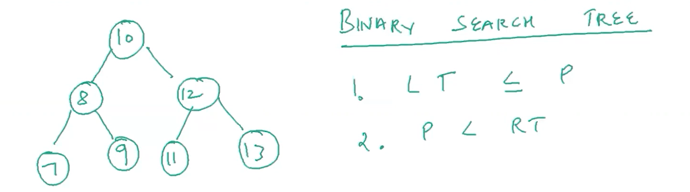
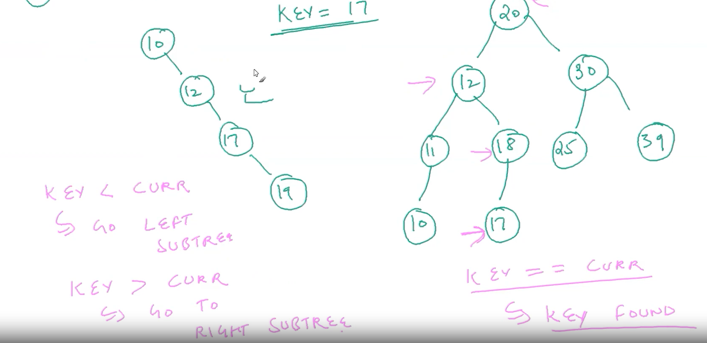

# BINARY-SEARCH-TREE-DSA
Binary-search-trees-in-JavaScript

| No.| Questions                                                                                                                                                                   |
| ---| ----------------------------------------------------------------------------------------------------------------------------------------------------------------------------------------------------------------------------------------------------------------------|
|    | **Binary search tree**                                                                                                                                                     |                                                                                                                                                  
| 1  | [Binary-search-tree-and-its-applications](#)                                                                                                                                |
| 2  | [Height-balanced-BST](#)                                                                                                                                                    |
| 3  | [BST Insertion](#)                                                                                                                                                          |
| 4  | [Inorder successor and predecessor](#)                                                                                                                                      |
| 5  | [BTS Delection](#)                                                                                                                                                          |

| 1  | [Binary-search-tree-and-its-applications](#)   
# 1.1 Binaary search Tree 

 Let we assume that 'LEFT' :sub-tree  ≤ P' is called left side smaller 
  

 Let we assume that 'RIGHT' :sub-tree ≥  P' is called right side is bigger 
  

# 1.2 Binary search Tree
<ul>
<li>
 same like wise LEFT PARENT value 

<li>
 KET REPRESENTS values of the tree and CURRENT tells the value of PARENT 

<li>
 When ever KEY values LESS then the CURRENT PARENT value then its represents the LEFT side of the tree 

</li>
 Select the LEFT side elements of the KEY values which are LESS than PARENT TREE
 

<li>
 Same like wise RIGHT PARENT value 

<li>
 KET REPRESENTS values of the tree and CURRENT tells the value of PARENT 

<li>
 When ever KEY values GREATER then the CURRENT PARENT value then its represents the RIGHT side of the tree 

<li>
 select the RIGHT side elements of the KEY values which are GREATER than PARENT TREE 
</li>

<li>
 KEY === CURRENT is equal to parent value 
</li>

<li>
 DISTENCE From root node to fargest d done is 4 

<li>
 Distence feom fargest d node to root node is HEIGHT of the Tree 
</li>
<li>
search is taken as o(h) time,I can search any type of tree 
</li>
<li>
height of the Tree is also 4 and the number of compressions is also 4 
</li>
<li>
 IMP 11.19

<li>
 Binary Search search TREE=> o(h) and in an unsorted array |---------------| o(n) 

<li>
 search time complexity is o(h) times 
p </li>
<li>
 restrict the hight of the array in an unsorted array we need to ettrate o(n) times 

<li>
 let say construct a tree a binary search tree then h =log(n) the the SEARCH will becomes =>o(h)  means SEARCH => o(logN) 
</li>

   
 if h == logN   NODES =7 AND HEIGHT H = log 7 2 => 3
   
 IF h == logN   NODES =4 and HEIGHT h = log 4 4 =>
  
in a stand binary standard there is non restrection
 
  
In a balanced binary search tree it is directly it is h= o(logn) and search = o(logn)
      
<li>
 Search complexity improve dramatically o(n), if h == logn  
 
<li>
 Search=> o(logn) 

<li>
 Nodes , N =7 anf HEIGHT , h=log7 2 
</li>
<li>
 |h(l) - h(r)| ≤ 1    

  
</ul>

| 2  | [Height-balanced-BST](#)   
# HBT-types

 red black tree 

 ALv trees 

<li></li>

